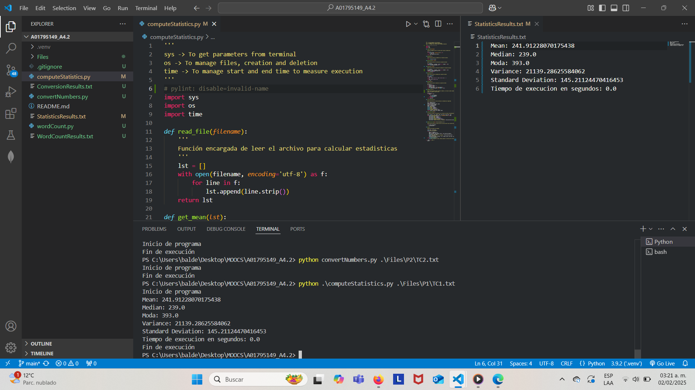
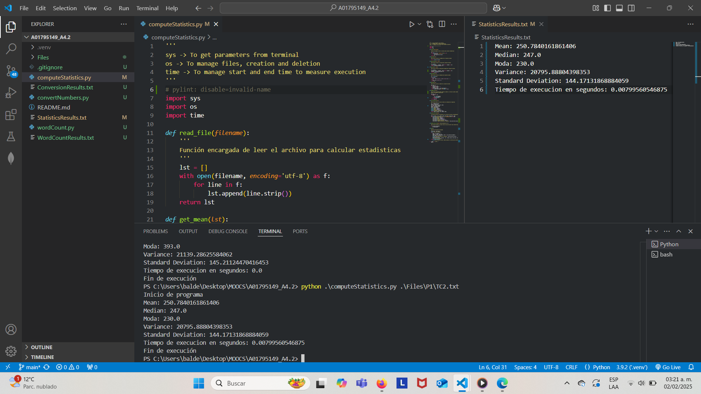
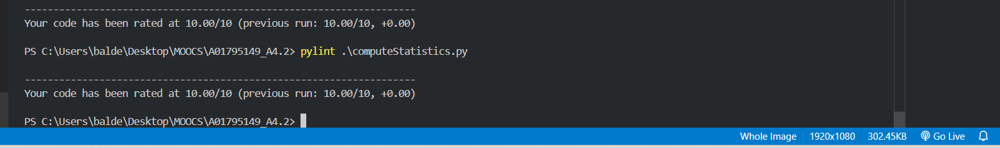
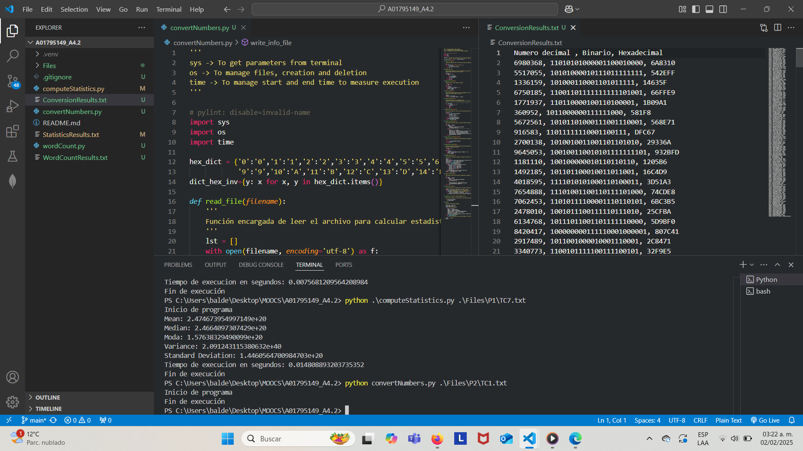
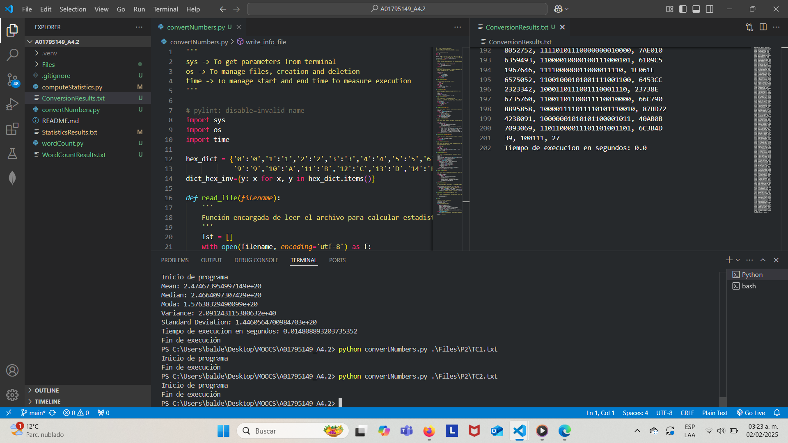
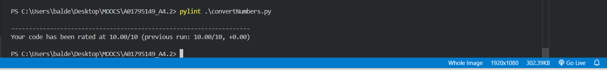
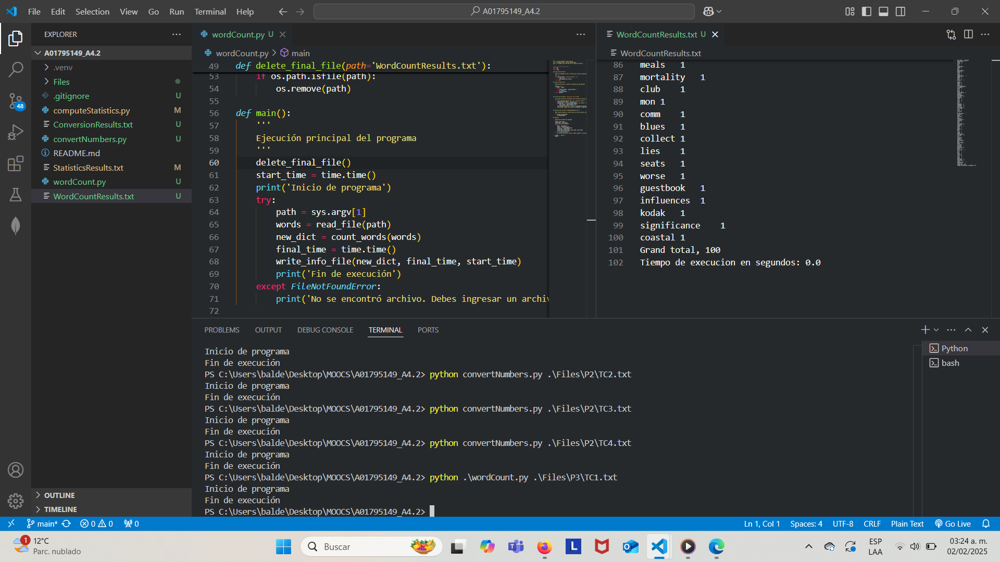
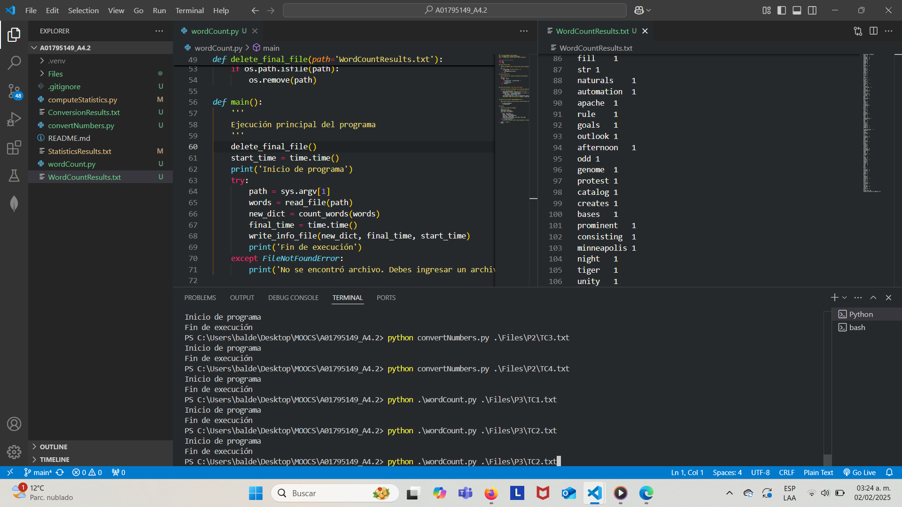
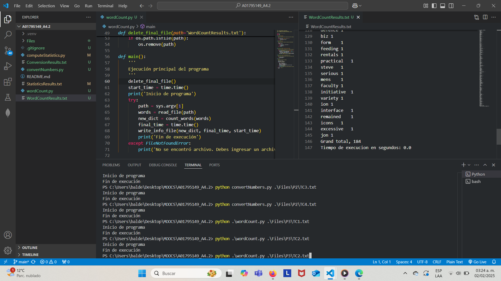
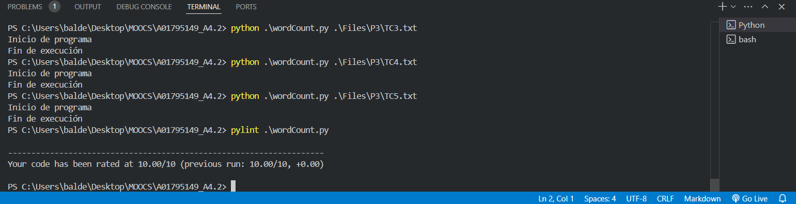

# Problem Set #1

## computeStatistics
Evidencia de ejecución correcta en varios casos

Evidencia de pylint

## convertNumbers
Evidencia de ejecución correcta en varios casos

Evidencia de pylint

## wordCount
Evidencia de ejecución correcta en varios casos

Evidencia de pylint
